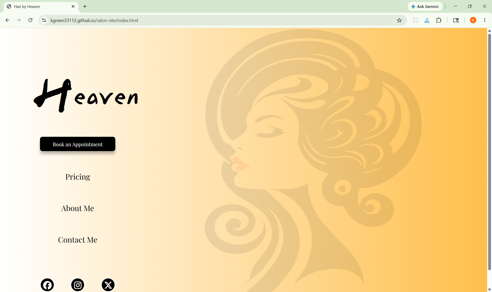
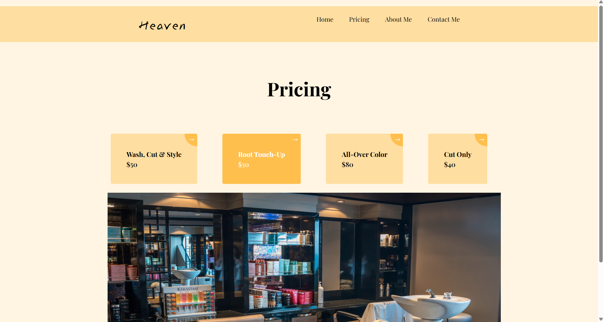

# Salon Site
A clean, minimal website built with HTML, CSS, and minimal JavaScript. 
This project focuses on CSS hover effects, HTML forms, and UI design implementation. 

## Live Demo
[View Live Salon Site](https://kgreen33112.github.io/salon-site/)

## Screenshots

### Landing Page

### Price Card Hover Effect

## Built With
- HTML
- CSS
- JavaScript
- Font Awesome
- Figma

## Features
- Various CSS hover effects on buttons, sidebar navigation items, social media icons, and pricing cards
- HTML forms

## Future Improvements
- Additional site pages
- Backend data storage for forms and contact requests
- Scheduling interfaces
- Expanded interactive elements
